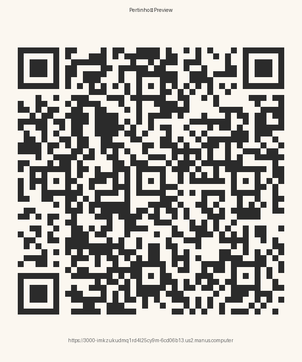
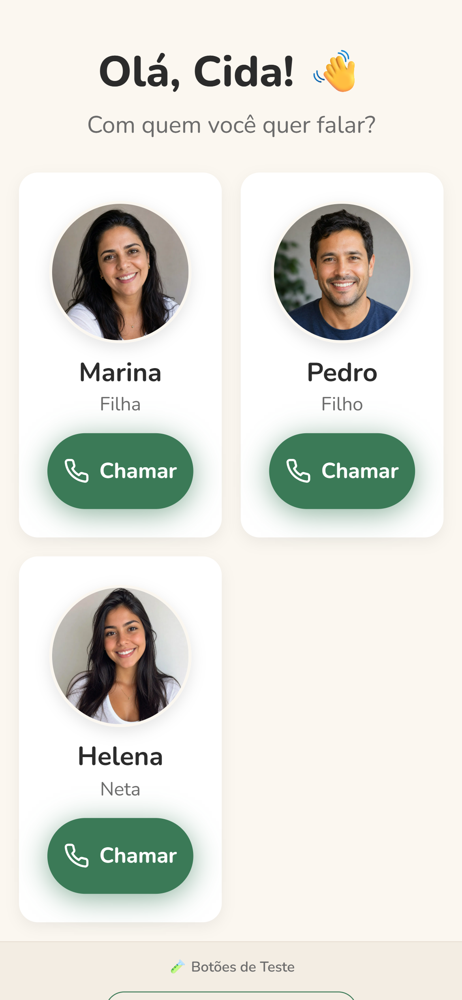
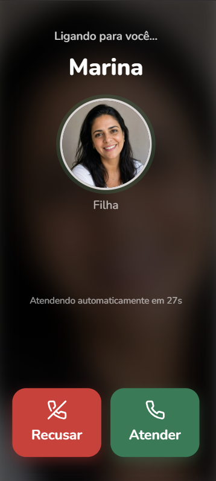
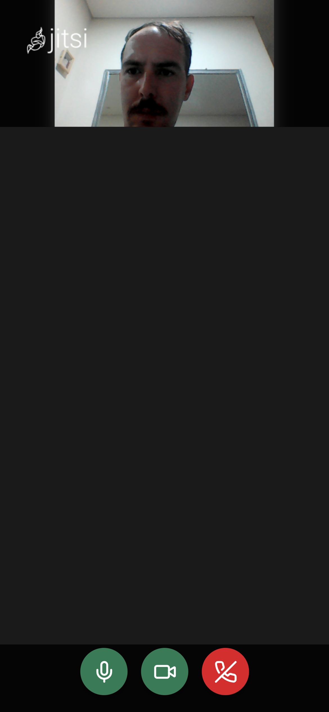
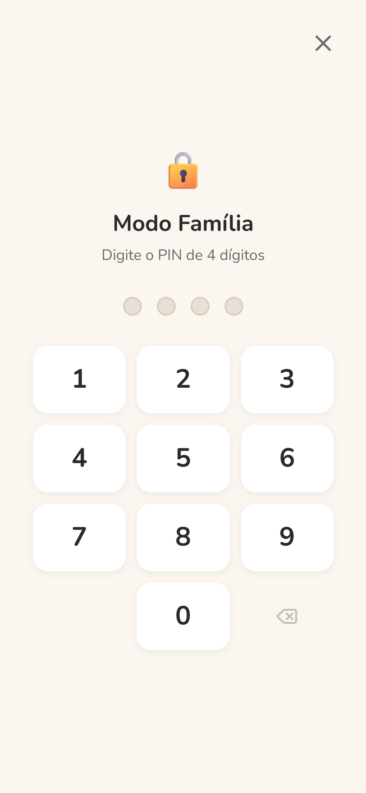
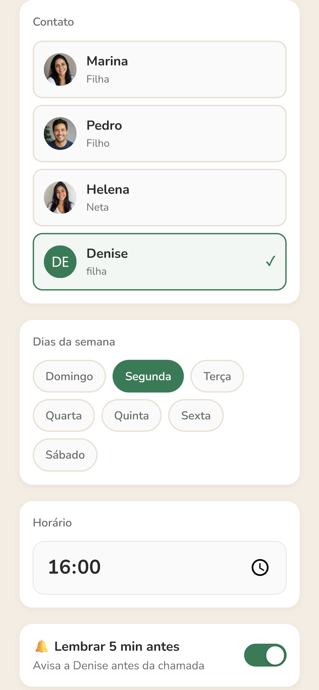
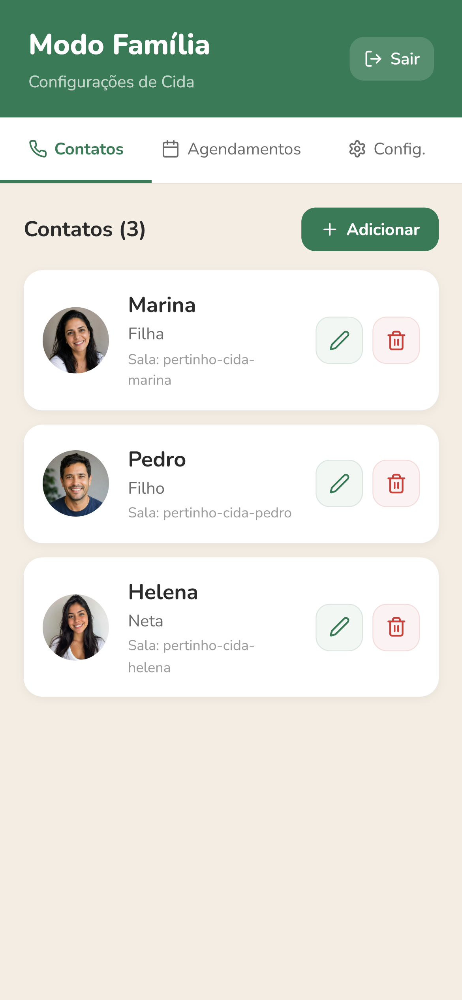
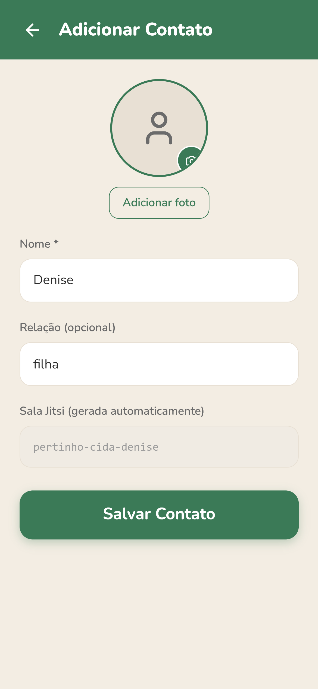
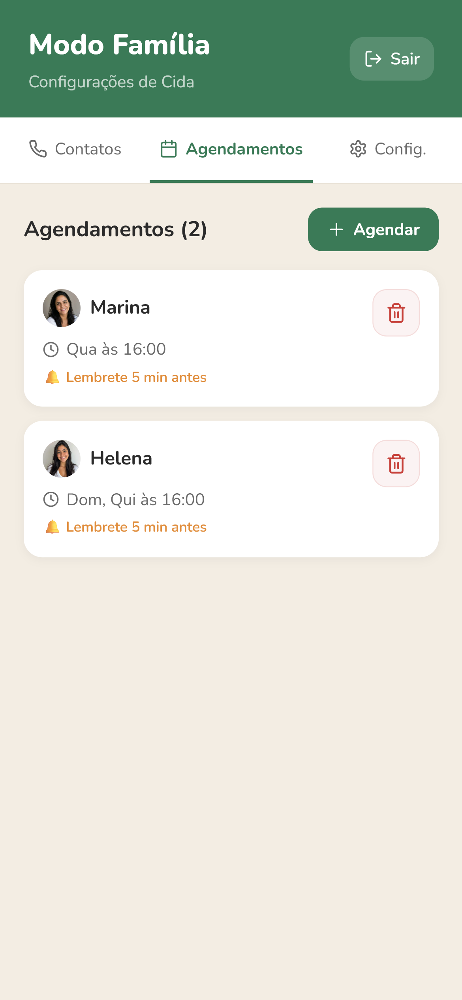
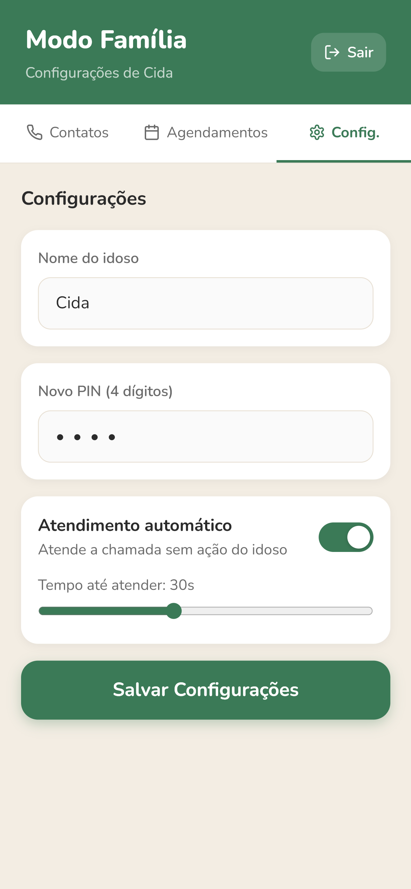

# Pertinho 💛

> Videochamada para quem é importante demais para esperar o neto explicar de novo como abrir o WhatsApp.

   

---

## 🔗 Pré-visualização

**Link de teste:** (https://manus.im/share/xudJFeOrklqQhZTBvvRR2p)

**QR Code para acesso rápido:**

<p align="center">
  
</p>

> Aponte a câmera do celular para o QR Code acima ou acesse o link diretamente no navegador.

---

## 🎯 O Problema

A videochamada é hoje o principal canal de presença emocional à distância — especialmente entre idosos e seus filhos que moram em outra cidade. Mas os apps disponíveis foram desenhados para usuários nativos digitais.

Para o idoso médio, abrir o WhatsApp, encontrar o contato certo, identificar o ícone de câmera e confirmar a chamada é uma cadeia de **cinco ou mais decisões de UX** que falha em qualquer ponto. O custo desse atrito não é técnico, é afetivo: **liga-se menos**.

## 💡 A Solução

**Pertinho** é um app de videochamada projetado em dois modos:

- **Modo Idoso** — uma única tela com os rostos de quem importa. Toca no botão verde, chamada acontece. Nada mais.
- **Modo Família** — acessado por um gesto secreto (toque longo no canto da tela) e um PIN de 4 dígitos. Permite ao filho/cuidador cadastrar contatos, agendar chamadas recorrentes e configurar atendimento automático.

A infraestrutura de chamada usa **Jitsi Meet** com salas determinísticas geradas automaticamente para cada par idoso-familiar (ex: `pertinho-cida-marina`). O idoso nunca vê um código, link ou nome de sala.

## ✨ Por que é diferente

| Apps tradicionais | Pertinho |
|---|---|
| Lista de contatos com texto pequeno | Cards grandes com foto e nome |
| Vários ícones para iniciar a chamada | Um botão "Chamar" por contato |
| Tela de chamada com 8+ controles | 3 botões grandes: Silenciar, Desligar, Câmera |
| Configuração feita pelo próprio idoso | Configuração centralizada no Modo Família |
| Chamada exige conhecer link ou código | Sala Jitsi gerada e invisível ao usuário |

## 📱 Capturas de Tela

### Modo Idoso

| Tela inicial | Recebendo chamada | Em chamada (Jitsi ao vivo) |
|:---:|:---:|:---:|
|  |  |  |

### Modo Família

| Painel (Contatos) | Agendar chamada | Acesso por PIN |
|:---:|:---:|:---:|
|  |  |  |

### Telas adicionais

| Adicionar contato | Lista de agendamentos | Configurações |
|:---:|:---:|:---:|
|  |  |  |

## 🛠️ Tecnologias

- **Plataforma alvo:** Android (preview disponível como Web App)
- **UI:** React + Tailwind CSS (componentes gerados via Manus AI)
- **Videoconferência:** Jitsi Meet External API (`meet.jit.si`)
- **Persistência:** localStorage (preview) / Room (build Android)
- **Design System:** paleta custom (creme + verde-floresta + vermelho-terracota), tipografia Nunito
- **Ferramenta de IA generativa:** Manus AI (estruturação do app e geração de telas)

## 🚀 Instalação

### Opção 1 — Pré-visualização Web (recomendado para demonstração)

1. Acesse o [link de pré-visualização](#-pré-visualização) acima
2. Ou escaneie o QR Code com a câmera do celular
3. O app abre direto no navegador, sem instalação

### Opção 2 — Compilar localmente a partir do código-fonte

```bash
git clone https://github.com/ChrystiannSangiorgi/portfolio-chrystiann-caesar-sangiorgi-de-oliveira.git
cd portfolio-chrystiann-caesar-sangiorgi-de-oliveira/projeto-desenvolvimento-de-app-de-video-conferencia-com-manus-ai-e-jitsi/src
npm install
npm run dev
```

O preview local sobe em `http://localhost:3000`.

## 🧭 Como Usar

### Primeira configuração (Modo Família)

1. Abra o app pela primeira vez no celular do idoso
2. Toque por 3 segundos no canto inferior direito da tela inicial
3. Digite o PIN padrão: `1234` (você pode alterá-lo na aba "Config.")
4. Cadastre o nome do idoso e adicione os contatos da família (foto + nome + relação)
5. Agende chamadas recorrentes na aba "Agendamentos" se desejar

### Uso diário (Modo Idoso)

1. A tela inicial mostra os rostos dos familiares cadastrados
2. **Para ligar:** toque no botão verde "Chamar" abaixo do contato
3. **Para atender uma chamada:** toque no botão verde grande
4. **Para desligar:** toque no botão vermelho durante a chamada

### Do lado da família

Cada familiar entra na sala via link direto (`https://meet.jit.si/pertinho-{nome-idoso}-{nome-familiar}`) ou pelo próprio Pertinho instalado em seu celular. As salas são geradas automaticamente — **não há código para trocar**.

## 🤖 Sobre o Desenvolvimento com Manus AI

Este projeto foi desenvolvido com auxílio do **Manus AI** como parte da disciplina de **Engenharia de Prompt e Aplicações em IA**. O prompt estruturado completo (briefing em 9 seções: contexto, personas, telas, comportamentos, design system, acessibilidade, dados mock, stack e critérios de aceite) está documentado em [`docs/prompt-manus.md`](./docs/prompt-manus.md).

A escolha do Manus AI permitiu prototipar rapidamente uma interface com forte coerência de design system, mantendo o foco do trabalho na **concepção do produto** (problema → solução → fluxos de uso) em vez da codificação repetitiva de telas. O processo de iteração com o Manus envolveu três ciclos principais:

1. **Geração inicial** a partir do prompt estruturado
2. **Refinamento da integração Jitsi Meet** (passagem de mockup para chamada real via External API)
3. **Polimento de UX** (tamanhos de botão, esconder elementos técnicos do usuário final)

## 📁 Estrutura do Projeto

```
projeto-desenvolvimento-de-app-de-video-conferencia-com-manus-ai-e-jitsi/
├── README.md                    # este arquivo
├── docs/
│   └── prompt-manus.md          # prompt estruturado usado no Manus AI
├── assets/                      # screenshots e QR Code
└── src/                         # código-fonte gerado pelo Manus
```

## 🗺️ Roadmap

- [ ] Notificações push para chamadas perdidas
- [ ] Modo "ligar para toda a família" (sala coletiva)
- [ ] Histórico de chamadas com botão "ligar de novo"
- [ ] Integração com Google Calendar para sincronizar agendamentos
- [ ] Build APK Android nativo via Capacitor

## 👤 Autor

**Chrystiann Caesar Sangiorgi de Oliveira**
Estudante de Ciência da Computação
Disciplina: Engenharia de Prompt e Aplicações em IA
GitHub: [@ChrystiannSangiorgi](https://github.com/ChrystiannSangiorgi)

## 📄 Licença

MIT — sinta-se livre para usar, modificar e distribuir.
